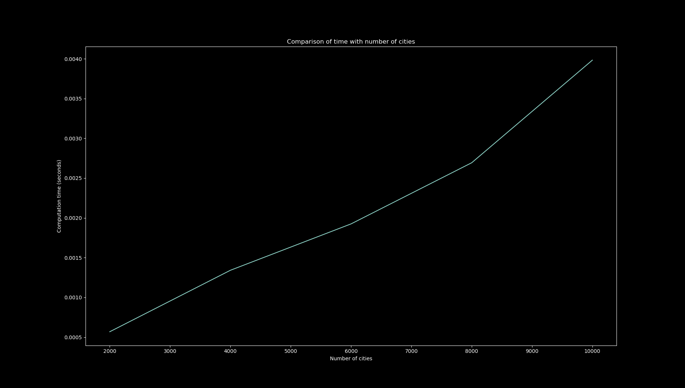
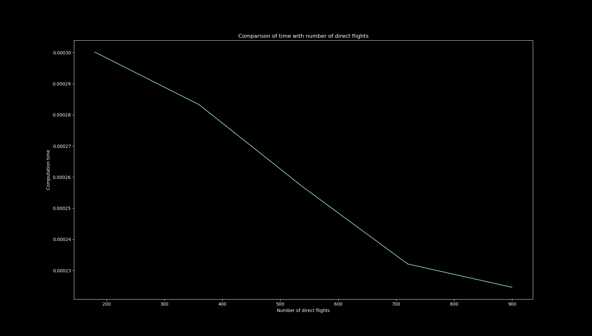

# Flight Path BFS Algorithm
Measuring the time taken for BFS Algorithm for:
1. Different number of cities in graphs (Nodes)
2. Different number of non-stop flights (Vertices)

## Results

## Findings
1. As the number of cities increase, the computation time increases as the size of the graph network increases
2. The increase in number of direct flights creates more path, increasing the likelihood of a shorter path to the destination. This decreases the computation time of the BFS algorithm

## Usage
#### Number of Cities Computation
<pre><code>$ python numCities.py</code></pre>

#### Number of Direct Flights Computation
<pre><code>$ python numDirectFlights.py</code></pre>

Graphical plot results are stored in _/imgs_ directory